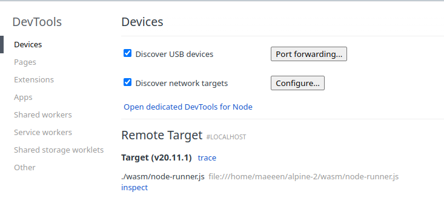
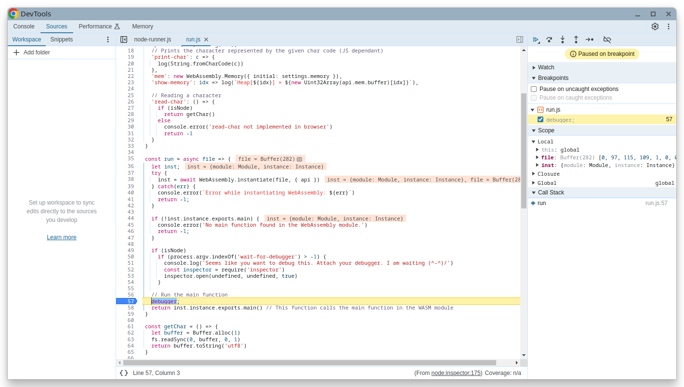

# Lab 06 - Compiler WASM

In this fifth lab, you will implement the code generation phase to generate WebAssembly.
Recall that a transpiler is a compiler that translates code from one programming language to another language meant to be read and modified by humans. In this case, WebAssembly is not meant to be read or modified by humans, therefore, we use the name compiler instead.

## Obtaining the lab files

As usual, you can obtain the lab files from the course's Git repository or from the zip archive on Moodle. Then, copy the following files into your project:

```console
alpine/
├── src/
│   ├── main/
│   │   ├── scala/
│   │   │   ├── alpine/
│   │   │   │   ├── driver/                   <----- COPY FROM THIS WEEK FILES
│   │   │   │   ├── evaluation/
│   │   │   │   ├── parsing/
│   │   │   │   ├── util/
│   │   │   |   ├── codegen/                 
│   │   │   |   |   ├── CodeGenerator.scala   <----- COPY FROM THIS WEEK FILES
│   │   │   |   ├── wasm/                     <----- COPY FROM THIS WEEK FILES
│   │   │   ├── Main.scala                    <----- COPY FROM THIS WEEK FILES (replace the current one)
├── test/
|   ├── res/
|   │   ├── codegen/                          <----- COPY FROM THIS WEEK FILES
│   ├── scala/
│   │   ├── alpine/
|   |   |   ├── codegen/                      <----- COPY FROM THIS WEEK FILES
│   │   │   ├── evaluation/
│   │   │   ├── parsing/                      
|   |   |   ├── transpiler/
|   |   |   |   ├── TranspilerTests.scala     <----- COPY FROM THIS WEEK FILES (to run this week's tests with the Transpiler)
│   │   │   ├── util/                         
├── wasm/                                     <----- COPY FROM THIS WEEK FILES
```

### Dependencies

#### Test dependencies: Node.JS and NPM

To be able to run WebAssembly code, you need to have the proper environment installed, including the WebAssembly virtual machine.

It is required to have the following dependencies installed in your system:

* [Node.js](https://nodejs.org/en/download/), with the latest LTS version (20)
  * On Windows, use the installer
  * On Linux, macOS, or Chocolatey, use [Download Node.JS](https://nodejs.org/en/download/package-manager)
  
To ensure that Node.js is properly installed, run the following command in your terminal, which should print a version number:

```bash
node -v
```

You will also need *Node Package Manager* (npm).
npm is usually bundled with Node.js and should be installed if you followed the instructions above.
To ensure that it is properly installed, run the following command in your terminal, which should print a version number:

```bash
npm -v
```

If you decide to install Node.js with another technique (e.g. that may be specific to your Linux distribution), make sure that npm is installed as well.

#### Test dependencies: `wat2wasm`

You will also need the `wat2wasm` tool to compile WebAssembly text files to binary files.
`wat2wasm` is part of a WebAssembly Development toolkit named `wabt`. To install it, please follows the instructions on the [official GitHub repository]("https://github.com/WebAssembly/wabt").

Make sure that wat2wasm is properly installed by running the following command, which should print a version number:

```bash
wat2wasm --version
```

#### Debugging dependency: Chrome/Chromium (recommended)

Consider using Chrome and Chromium, as they offer a good debugging experience for WebAssembly.

Any other browser/code editor/IDE that supports WebAssembly debugging can be used (e.g. VSCode).

## Web Assembly introduction

WebAssembly is a binary instruction format for a stack-based virtual machine.

### Instructions

The instructions are defined in the `WasmTree.scala` provided file. Usually, instructions are represented as a string, e.g. `i32.add` to add two 32-bit integers.

A list of instructions along with its documentation is given in the same file.

As an example, this WASM program adds two numbers (note that `;` is use to start comments):

```wasm
; empty stack
i32.const 1 ; pushes 1 to the stack
; stack = [1]
i32.const 2 ; pushes 2 to the stack
; stack = [1, 2]
i32.add     ; pops two values from the stack, adds them, and pushes the result
; stack = [3]
```

We will only use a subset of the instructions in this lab, namely the floating points, integer arithmetic operations -- 32 and 64-bits -- and linear memory.

We recommend that you read `WasmTree.scala` to understand WebAssembly instructions.

### Functions

WASM supports functions, which are defined by a sequence of instructions, local types (if any) and the return type (if any).

As an example, this WASM program defines a function that adds two numbers:

```wasm
(func $add (param i32 i32) (result i32)
  local.get 0
  local.get 1
  i32.add
)
```

Its equivalent representation in the provided WASM Scala tree would be:

```scala
FunctionDefinition("add", params = List(I32, I32), returnType = Some(I32), body =
  List(
    LocalGet(0),
    LocalGet(1),
    IAdd
  )
)
```

#### Return type

The return type annotation of a function is optional in WebAssembly: if no annotation is given, the function returns nothing on the stack (in other words, it is equivalent to a function returning `Void` or `Nothing` in Scala).
That is why the return type of functions in the Scala tree is an `Option`.
If the WebAssembly function isn't supposed to return anything, its return type in the Scala tree should be `None`.

If the function returns a value, the return type is `Some(type)`, where `type` is the type of the return value (i.e., `I32`, `F32`, `I64`, or `F64`).

If it returns something, the function should end with only a single element of the specified type on the stack.

If it should return nothing, it should return with an empty stack.

#### Calling functions

For a function `f`, having `n` parameters,

```scala
// expects n parameters on the stack
// stack = prev ++ [param1, param2, …, paramn]
Call("f")
// if f returns a value, the stack will be prev ++ [result]
// if f returns nothing, the stack will be prev
```

#### Locals

Locals are variables that are only accessible within the function. They can be get/set by the `local.get` and `local.set` instructions.

```scala
FunctionDefinition("util", locals = List(I32, I32) body =
//                            first local ↑    ↑ second local
  List(
    // stack = []
    IConst(42),
    // stack = [42]
    LocalSet(0), // sets the first local
    // stack = []
    LocalGet(0), // gets the first local
    // stack = [42]
    Call("print"), // prints the value
    // stack = []
  )
)
```

Parameters of a function are also locals. The accessing order is first params in order, then locals.

#### Main function

The runtime expects a function named `main` that does not take any parameters and can possibly return a value.

Such a function can be defined as follows in the provided WASM Scala tree:

```scala
MainFunction(body = …, returnType = …)
```

It is **mandatory** to use that case class to define the main function because it needs to be exported as `main`, and NOT defining a normal function named `main`. It is also mandatory to define at least a main function.

### Modules

A WASM module is a collection of functions and imports. The module is the top-level structure of a WASM program.

In our case, we will only use the `FunctionDefinition`, `ImportFromModule` and `ImportMemory`.

We will generate a single WASM module that contains all functions and imports of the Alpine program.

### `ImportFromModule`

WASM allows to import functions. A module can be a WASM file or a JavaScript file.

The idea is similar to the  `rt`/`runtime` module that we used in the previous lab. The WASM file is going to be ran in a JavaScript environment, and we can import functions from the JavaScript environment, e.g. `print-int`.

As a reference, you can use the following list of imports:

```scala
Module(
  List(
    // Import `api.print` as `print`, a function that takes an integer and returns nothing (prints a number)
    ImportFromModule("api", "print", "print", List(I32), None),
    // Import `api.print` as `fprint`, a function that takes a float and returns nothing (prints a floating point)
    ImportFromModule("api", "print", "fprint", List(F32), None),
    // Import `api.print-char` as `print-char`, a function that takes an integer and returns nothing (prints a character)
    ImportFromModule("api", "print-char", "print-char", List(I32), None),
    // Import the linear memory
    ImportMemory("api", "mem", 100)
  ),
  List(… functions …)
)
```

### Linear memory

WASM supports linear memory, which means that the memory the program can access is a contiguous array of bytes. The program uses this memory to store data that is not on the stack (more commonly known as a heap).

For instance, to store the number `0xdeadbeef` at location 0 of the linear memory, you would use the following piece of code:

```wasm
i32.const 0 ; index
i32.const 0xdeadbeef
i32.store
```

which in the provided WASM tree would be:

```scala
List(
  I32Const(0),
  I32Const(0xdeadbeef),
  IStore
)
```

Please note a few things:

* the memory is addressed in **bytes**, so you need to compute the correct index by using the sizes of the elements you are storing (e.g. 4 bytes for an `i32`).
* WASM is little endian (meaning that the least significant byte is stored first). For instance, with the above example, the memory would contain:

```js
mem[0] = 0xef
mem[1] = 0xbe
mem[2] = 0xad
mem[3] = 0xde
```

If you now decide to store `0x12345678` at index 1, the memory would now contain:

```js
mem[0] = 0xef
mem[1] = 0x78
mem[2] = 0x56
mem[3] = 0x34
mem[4] = 0x12
```

Hence, printing an 32-bits integer from the memory at index 0 would print `0x345678ef` (index 0 is the least significant byte and at index 3 is the most significant byte).

This is particulary important while debugging.

### Example program

Here is an example of a program:

```scala
  val module = Module(
    List(
      // Importing as specified above
      ImportFromModule("api", "print", "print", List(I32), None),
      ImportFromModule("api", "print", "fprint", List(F32), None),
      ImportMemory("api", "mem", 100),
      // An extra function to print a character
      ImportFromModule("api", "print-char", "print-char", List(I32), None),
      // An extra function to show the memory, at a specific index
      ImportFromModule("api", "show-memory", "show-memory", List(I32), None)
    ),
    List(
      FunctionDefinition("heap-test", body =
        List(
          // Stores 0xdeadbeef at index 0
          IConst(0),
          IConst(0xdeadbeef),
          IStore,
          // Shows the memory at index 0
          IConst(0),
          Call("show-memory"),
          // Stores 0x12345678 at index 4
          IConst(4),
          IConst(0x12345678),
          IStore,
          // Shows the memory at index 4
          IConst(4),
          Call("show-memory"),
          
        )
      ),
      FunctionDefinition("local-test", locals = List(F32, F32), returnType = Some(F32), body =
        List(
          FConst(3.14),
          // stack = [3.14]
          LocalSet(0),
          // Local 0 = 3.14
          // stack = []
          FConst(1.67),
          // stack = [1.67]
          LocalSet(1),
          // stack = []
          // Local 1 = 1.67
          LocalGet(0),
          // stack = [3.14]
          LocalGet(1),
          // stack = [3.14, 1.67]
          FSub
          // stack = [1.47]
          // In fact it returns 1.470000147819519 because of numerical imprecision
          // of 32-bit floating points
        )
      ),
      MainFunction(
        List(
          IConst(1),
          // stack = [1]
          IConst(2),
          // stack = [1, 2]
          IAdd,
          // stack = [3]
          Call("print"),
          // stack = []
          // prints 3
          Call("heap-test"),
          // Printed
          // Heap[0] = 0xdeadbeef
          // Heap[0] = 0x345678ef
          Call("local-test"),
          // stack = [1.47] / [1.470000147819519]
          Call("fprint"),
          // stack = []
          // prints 1.47 / 1.470000147819519
          IConst(0x41),
          // stack = [65] (ASCII code of 'A')
          Call("print-char"),
          // stack = []
          FConst(-1.5) // returns -1.5
        ),
        // Return type is F32
        Some(F32)
      )
    )
  )
```

### Compiling

WebAssembly can be represented in files in text format (`.wat`) or binary format (`.wasm`). Our runtime expects the binary format. Inside SBT, you can run:

```bash
run <path-to-alpine-file>
```

which would generate an `output.wasm` file and `output.wat` file.

### Running using Node.JS

To run the WebAssembly program with Node.JS, you can directly use the Alpine compiler. To run the program, run the following command in an SBT shell:

```bash
run -r <path-to-alpine-file>
```

Alternatively, you can directly run the WebAssembly program from the `.wasm` by calling Node.JS:

```bash
node ./wasm/node-runner.js ./output.wasm
```

### Running using the browser

To run the WebAssembly program in the browser, you can use the provided `wasm/index.html` file. You can open it in your browser.

Select the file `output.wasm` and click on “Run”. The log will be displayed on the page.

### Debugging the WebAssembly file with Node.JS and using Chrome/Chromium developer tools

Inside SBT, run:

```
run -d <path-to-alpine-file>
```

or directly with node 

```
node ./wasm/node-runner.js ./output.wasm wait-for-debugger
```

The following message will be displayed:

```
Seems like you want to debug this. Attach your debugger. I am waiting (^-^)/
Debugger listening on ws://127.0.0.1:9229/00a71467-1c5c-4052-8dac-b9e5f1be42fc
For help, see: https://nodejs.org/en/docs/inspector
```

Open Chrome/Chromium and go to `chrome://inspect`.



Click on “inspect” at the bottom.



You can then press twice “Step into the next function call” to get inside the WebAssembly code (<kbd>F11</kbd>). Then it is just like a normal debugger.

### Debugging the WebAssembly file with Node.JS and Visual Studio Code

Alternatively, you can use Visual Studio Code to debug the WebAssembly file.

Here is an example of `.vscode/launch.json` config file:

```json
{
  "version": "0.2.0",
  "configurations": [
    {
      "type": "node",
      "request": "launch",
      "name": "Run WASMs",
      "skipFiles": [
        "<node_internals>/**"
      ],
      "program": "${workspaceFolder}/wasm/node-runner.js",
      "args": ["${workspaceFolder}/output.wasm"]
    }
  ]
}
```

### Debugging the WebAssembly file with another browser

To debug the WebAssembly file in the browser, open the developer tools (<kbd>F12</kbd>) then click on the “Run” button.

You can then press twice “Step into the next function call” to get inside the WebAssembly code (<kbd>F11</kbd>). Then it is just like a normal debugger.

## Task

Your task is to implement the `CodeGenerator` class in the `CodeGenerator.scala` file.

You will only implement the code generator for a subset of the Alpine language, namely:

* Primitive data-types (int, float)
* Top-level bindings
  * Functions (`fun`)
  * Expressions (`let`)
* Records expressions
* Function calls
* If expressions

In particular, the will be no support for **lambda**s.

You are free to implement the code generator as you wish, but we strongly recommend to use the same approach as the previous labs, i.e., using a tree visitor.

### Tests

If you want to run the Codegen tests with the Scala transpiler for debug reasons, you can uncomment the two lines in the `TranspilerTests.scala` file.
